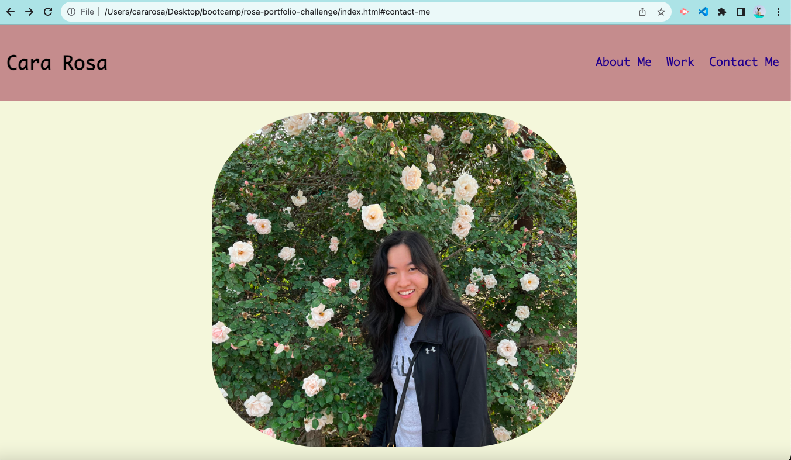
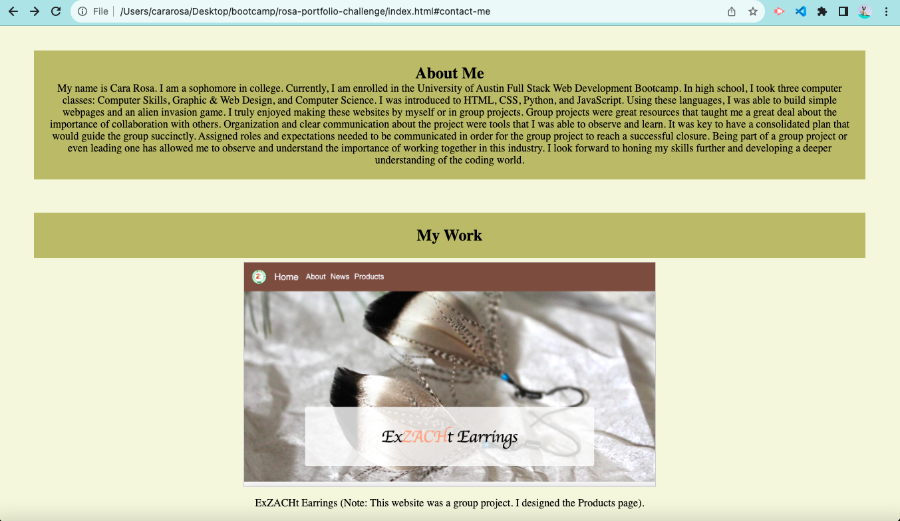

# Portfolio Website

## Description

My Personal Portfolio Website highlights my coding experiences, examples of my previous work and my contact information. My coding journey started in high school. I took three computer classes that introduced me to HTML, CSS,  Python, and JavaScript. These languages were the tools in which I built my websites. My portfolio shows my work in a gallery of cards. The ExZACHt Earrings website and the Horiseon website are my two primary examples. The remaining cards are placeholders for my future work. The ExZACHt Earrings website was a group project effort. It showcases handmade earrings made from varying bird feathers. I was assigned the role of coding the Products page. My first step was creating a mock-up in order to have an idea of how my webpage should be designed. After I completed this step, I began coding the website. The use of Bootstrap was helpful in order to efficiently make the layout of the page. CSS was applied for the color scheme of the page. The Horiseon website is dedicated to business’s success and safety. Search Engine Optimization, Online Reputation Management, and Social Media Marketing are the three main tools for a business to succeed with as little risk to reputation as possible. The design and styling of the website is previously coded. I refactored the code to make the website more accessible. In order to make it more accessible, I replaced non-semantic HTML elements with semantic HTML elements, organized and consolidated CSS selectors, added detailed comments about the code, and added alt text to the images. Future employers can view my Portfolio website in order to gather information about my accomplishments and my work. My contact information is included at the bottom of the website if they wish to reach out to me.

The Portfolio Website project challenges students to utilize flexbox, media queries, and CSS variables. The website focuses on a responsive design. Flexbox and media queries are essential in order to make the website design work across computer, tablet, and phone screens. CSS variables are the method in which styling can be applied to all elements of the website. These variables allow for color, sizing, placement, and actions of the elements. All of these components make the website a more pleasing and interactive experience for users.

The Gas-Finder web page is designed for users to find the best gas prices. In order to find the best gas prices, users can search by city, longitude, and latitude. After the user inputs the desired city, longitude, and latitude, the results are shown. The results include gasoline price for diesel, gasoline, and mid grade. After a user searches for a city, the city name is displayed to the web page in a box labeled Search History. Users now can easily view their previous city searches.

HTML, CSS, the Bulma framework, JavaScript, three APIs (Google Maps API, Gas Prices API, and Google Geocoding API) were utilized to complete this project. The HTML provided the structure of the page. Custom CSS was used to add the correct colors, font sizes, and placement of elements on the page. The Bulma framework helped in adding styling to the page quickly and efficiently. JavaScript was used to add the APIs and retrieve the data. The three APIs were essential in order to be able to have the right data for the results of the search.

## Installation

No installation is necessary. The link to the website is here: [Portfolio Website](https://cararosa.github.io/rosa-portfolio-challenge/).

Below are the screenshots of my Portfolio website shown in my browser:

## Credits

My instructor was able to help me make the gallery responsive with media query, centering the gallery and its content, and adding spacing around the About Me Section and My Work section. This code can be found in the style.css file in the subfolder css under the main folder assets. One of my gallery cards did not align in the gallery table properly. My instructor helped me to align it properly by deleting a part of my code and moving another part of code that was in the index.html file.

## License

An MIT License has been used for this website. Please refer to the rosa-portfolio-challenge repository for further details about the MIT License.
